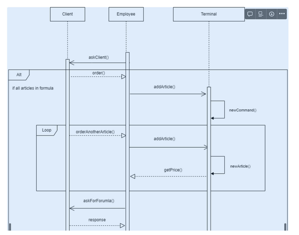
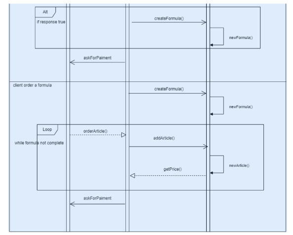

employé (server REST, pas de DB, push des messages jms)
caisse (recois des messages JMS, envoie à la banque et au programme de fidélité) DB
bank (recois des messages JMS, envoie JMS) DB
fidélité (recois des messages JMS ) DB

------------
# Projet Caisse

# 1.Système à modéliser

Un système de caisse ( avec préparation d’une commande jusqu'à son paiement ) utilisé par les employés d’une chaîne de restauration.

Au total, nous avons 5 projets : Client - Employe - Terminal - Bank - Fidelity

client → client REST

employe → serveur REST + JMS

terminal → serveur JMS

bank → serveur REST + JMS

fidelity → serveur JMS

# DESCRIPTION DU SYSTEME

On souhaite faciliter les échanges entre client et employé dans la restauration. Pour ce faire nous allons modéliser une interface pour les employés.

On commence par avoir un accès direct à tout les produits. À chaque ajout de produit, les produits sont stockés dans une commande. Avec la possibilité d’effacer des produits de la commande.

Un système de formule est également disponible : nous avons 2 formules, une formule pâtisserie (composée d’un dessert et d’une boisson) et une formule déjeuner.(composée d’un sandwich, d’un dessert et d’une boisson)

Avant de finaliser la commande, on a la possibilité de la payer.

Nous avons également à disposition un système de fidélité : les clients peuvent avoir un compte fidélité. Une fois connecté, à chaque passage en caisse le client obtient des points et à un certain nombre de points une remise immédiate est appliquée sur la commande.

## Règles métier

- 1 employé peut utiliser une caisse
- 1 employé peut s’occuper d’une commande à la fois
- Seul un dessert et une boisson peuvent former une formule pâtisserie
- Seul un sandwich, un dessert et une boisson peuvent former une formule déjeuner
- Si les 2 formules sont possible choisir la “déjeuner”

## Exigences du système :
- Le client doit pouvoir utiliser sa carte de fidélité et appliquer des réductions. ( 300 points → -10% sur la commande )
- Le client doit pouvoir payer
La gestion de fidélité permet de cumuler des points à chaque commande en fonction du montant de celle-ci (1€ = 10 points).
-  L’employé peut supprimer une commande
-  L'employé peut modifier une commande tant que celle-ci n’est pas payée (ajouter produit, supprimé produit)
-  La caisse doit générer un ticket de caisse
-  La caisse doit envoyer le prix total avant de faire payer le client
-  La caisse doit pouvoir appliquer des formule “automatiquement”
-  La banque peut accepter ou refuser un paiement

# 2. Schémas et diagrammes de séquences

## Diagramme de classe

## Diagramme de séquence

Le terminal renvoie l’order_Id après l’ajout du premier article pour ajouter les articles suivant dans la bonne commande

Le programme de fidélité augmente les points après la confirmation du paiement par la Banque

1€ = 10pts

300pts = -10% sur le total de la commande

# Organisation des projets

3 projets différents
Banque
Terminal
Fidélité

Chaque projet a sa propre bdd

